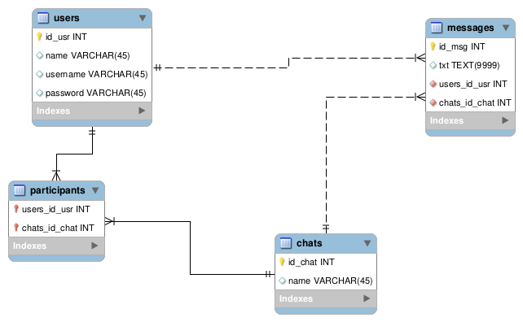

# API chat project and text sentiment analysis
 
In this project we want to communicate an API with a chat service for team members of a company. With this project we want to create users, chat rooms, add text messages, etc.
 
In addition, another task for the project is to analyze the sentiment of the chat messages in order to make sure that the workers of the company are happy.
 
To do so, I worked with the following tools to complete this challenge:
- `FLASK` - An API creation tool for python.
- `NLTK` - A python library to conduct Natural Language Processing.
 
In addition I used `MySQL` to handle the chat database, and I communicated it with the python code using `sqlalchemy` and `pymysql`.

## Initializing the server

In order to initialize the server we must execute these comands:

`export FLASK_APP=main.py`

`export FLASK_DEBUG=true`

`python3 -m flask run`

With this, the URL of the api is `http://127.0.0.1:5000/`
 
## API functions
 

`/chat/create/<name>` - Creates a chat room with a list of users

`/user/create/<username>` - Creates a new user

`/chat/adduser/` - Adds an existing user to a chat room

`/chat/addmessage/` - Adds a text message from certain user to a chat

`/chat/list/<chat_id>` - Lists all messages in a chat room

`/user/list/<user_id>` - Lists all messages written by certain user

`/chat/sentiment/<chat_id>` - Obtains the sentiment analysis of a chat room

`/user/sentiment/<user_id>` - Obtains the sentiment analysis of an user

`/chat/distance/` - Obtain the distance (similarity) of the conversations between two chats

`/user/distance/` - Obtain the distance (similarity) of the conversations between two users

 
## MySQL Database Creation
 
In the following figure I show a very simplistic database schema to handle the chat app.
 

 
I created a series of users and chat names to create the table and I assigned a random set of users for each chat. Lastly, I listed a series of random mensajes, so I made each user in each chat post some of them in a random order.
 
## Text sentiment analysis
 
Usin NLP we can infere the sentiment of a certain text. With the library `NLTK` I built some functions to obtain how positive, negative or neutral is each text message. This is used to compute the mean, median and dispertion of all the text messages in a chat, or all the ones sent by an user. The results can be retrieved using the API.
 
## Final thoughts
 
words
